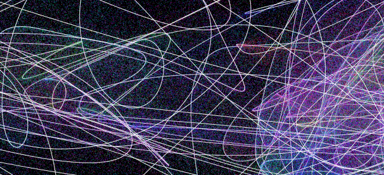

Neon Lights
===========

Screensaver for Haiku, loosely based on [Jared Tarbell's work](http://www.complexification.net/gallery/machines/citytraveler/).

Why?
----

For some time I happily used the [Substrate](https://github.com/haikuarchives/substrate) screensaver, but, it is only a port
of an existing Linux one. Haiku needed something more unique. Also, I couldn't convince some other people that Substrate is
so much nicer than the IFS screensaver. This is another attempt to make them switch to something more colorful.

License
-------

It is released under the MIT licence.

Greetings
---------

To Jared Tarbell for beautiful inspiration with sourcecode.

To Atalax for the port of Substrate to Haiku.

To the Haiku project for being there.
